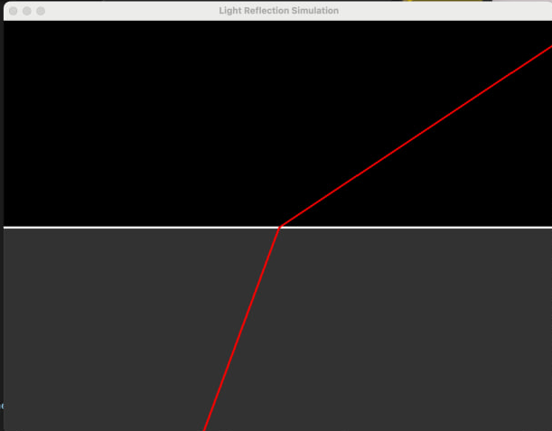

# Refraction Simulator

This Python application simulates the behavior of light as it passes from one medium to another with different refractive indices. The simulation visualizes the reflection and refraction of light waves using Snell's Law. The application includes an interactive interface that allows users to adjust various parameters, such as the refractive indices of the two mediums and the angle of incidence.



## Features

- **Interactive Sliders**: 
  - Control the refractive indices of the two mediums (`n1` and `n2`) using sliders.
  - Adjust the angle of incidence (`angle`) through a slider.
  
- **Real-time Visualization**: 
  - Watch the light wave reflect and refract dynamically as you change the parameters.

- **Dashed Normal Line**: 
  - The interface includes a dashed line representing the normal, helping visualize the angle of incidence and refraction.

## Getting Started

### Prerequisites

- Python 3.x
- The following Python libraries:
  - `pygame`
  - `kivy`

You can install the required libraries using pip:

```bash
pip install pygame kivy
```

### Running the Application

1. Clone the repository:

```bash
git clone https://github.com/HadiAgdam/RefractionSimulator.git
cd RefractionSimulator
```

2. Run the application:

```bash
python main.py
```

## How to Use

- **n1 Slider**: Adjust the refractive index of the first medium.
- **n2 Slider**: Adjust the refractive index of the second medium.
- **Angle Slider**: Adjust the angle at which light enters the second medium.
- The simulation will automatically update to reflect the changes in real-time.

## Snell's Law

The application simulates light behavior based on Snell's Law:

n1 * sin(θ1) = n2 * sin(θ2)

Where:

- n1 and n2 are the refractive indices of the first and second mediums, respectively.
- θ1 is the angle of incidence.
- θ2 is the angle of refraction.